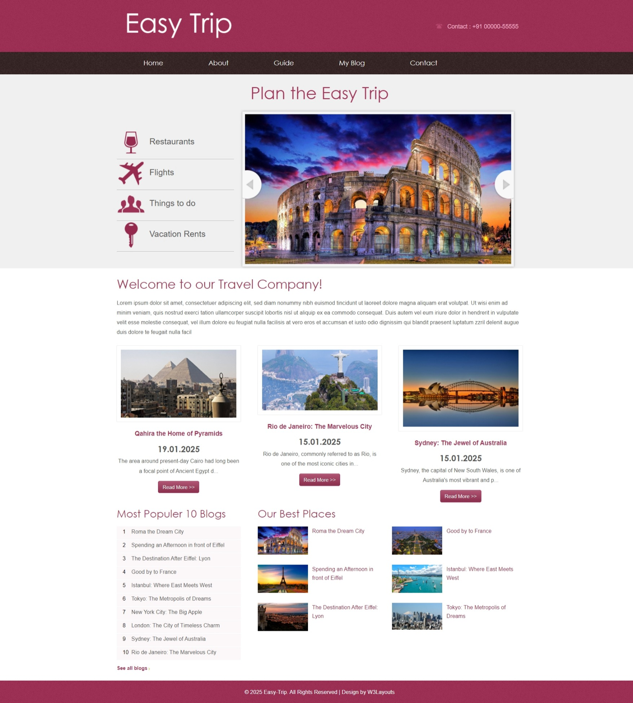
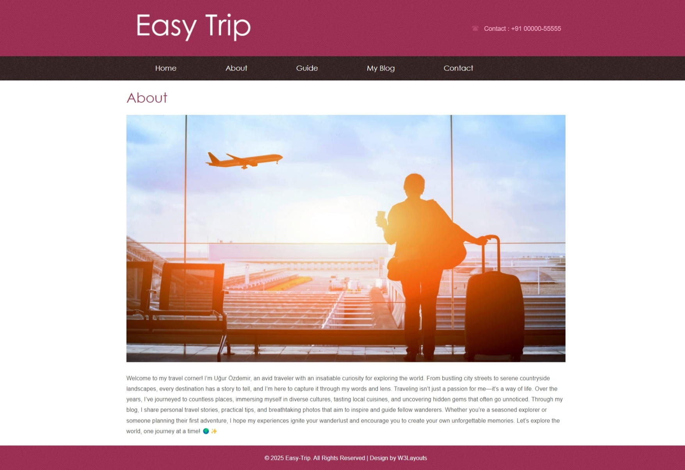
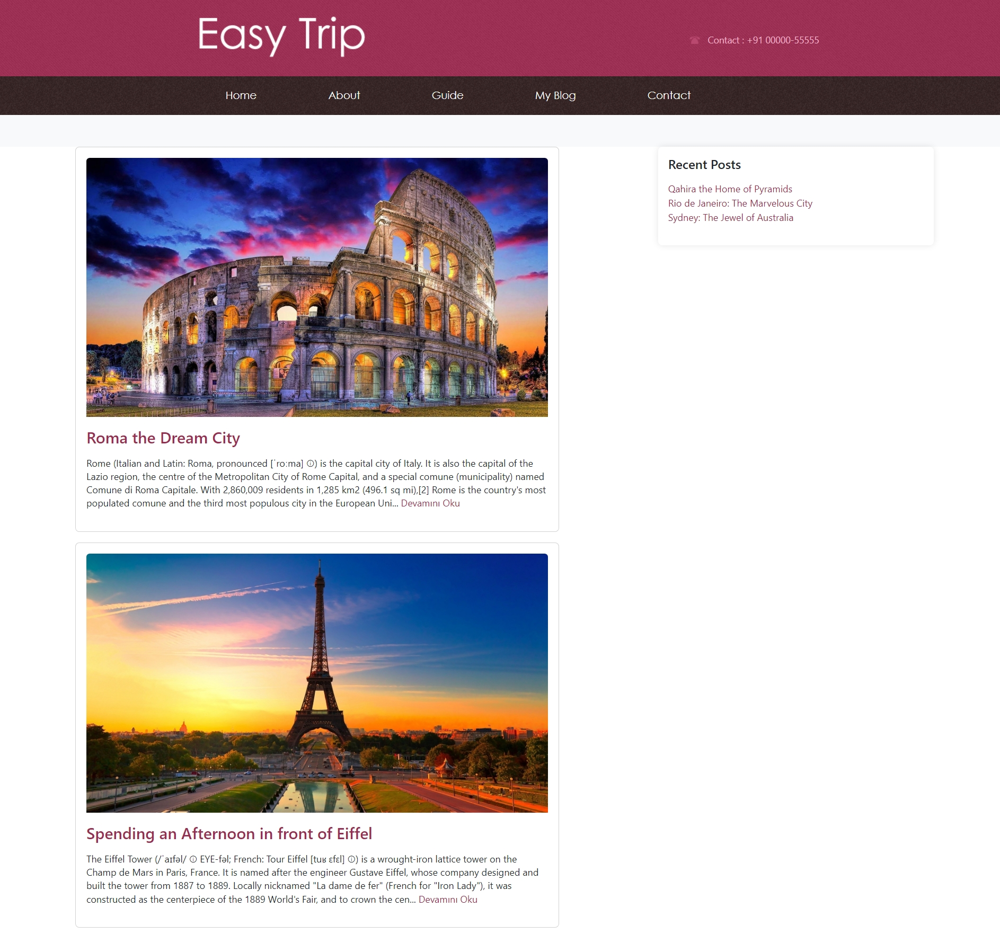
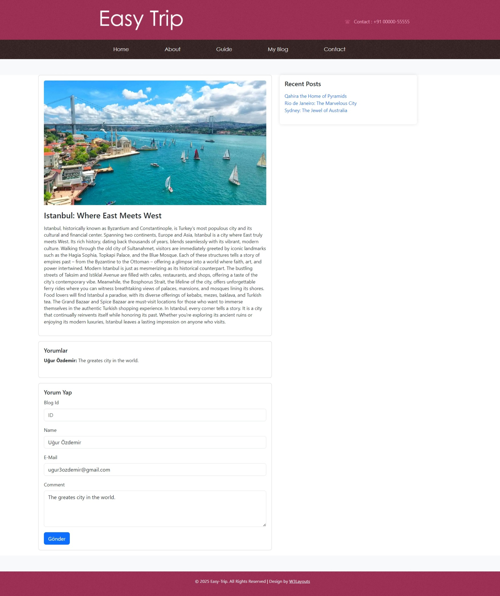
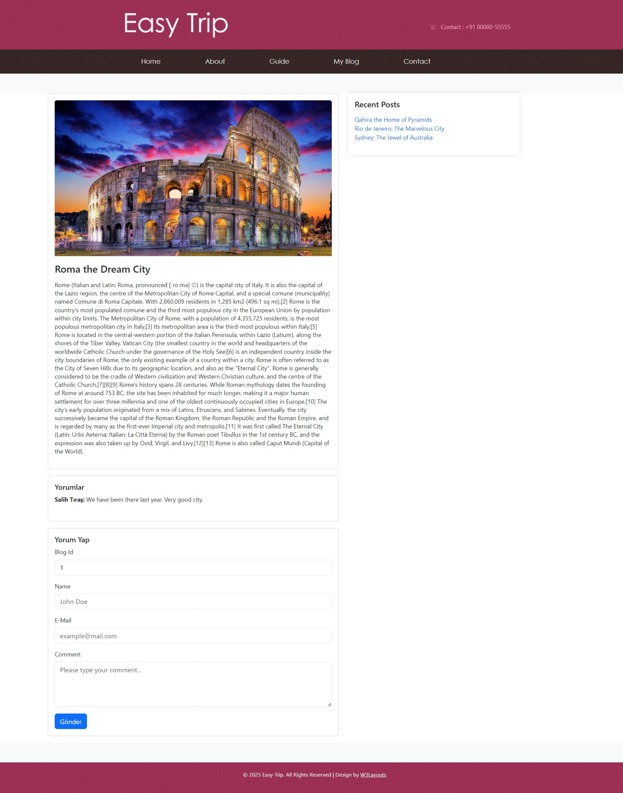
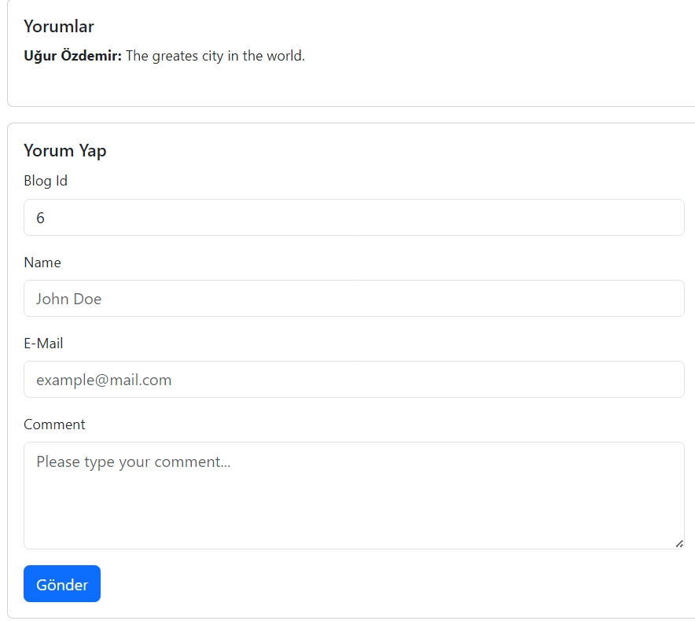
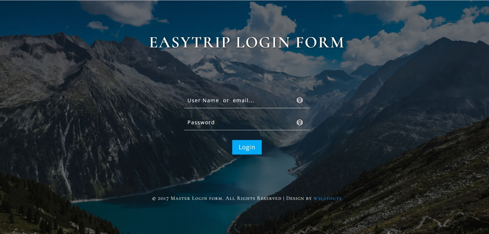
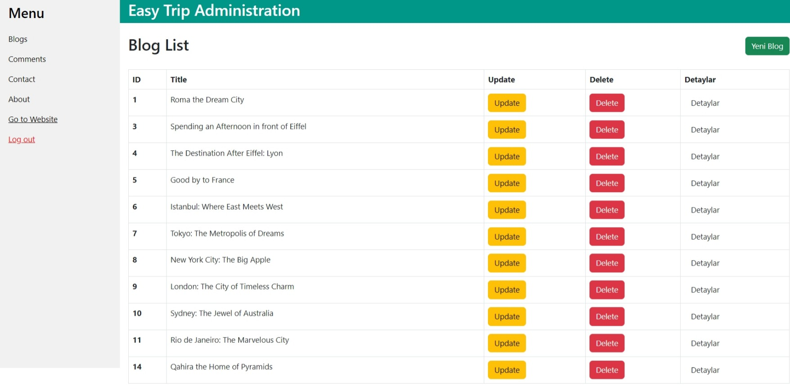
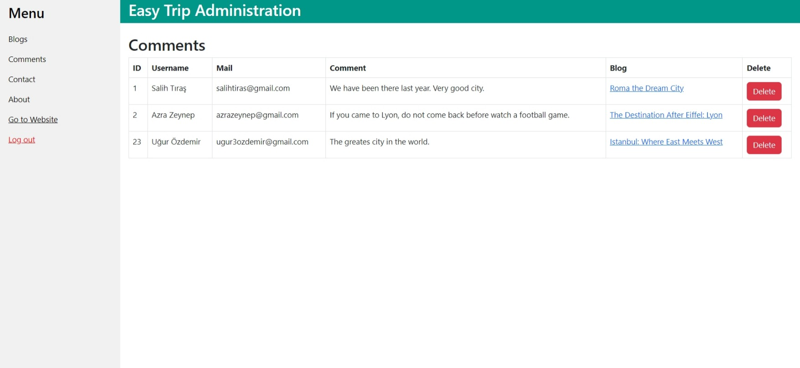

# 🌍 **EasyTrip - Kişisel Gezi ve Blog Sitesi** ✈️📸

Bu proje, kişisel gezi ve blog sitesi olarak tasarlanmıştır. 👣 Kişi, bu site aracılığıyla gezdiği yerlerdeki fotoğrafları paylaşabilir 📷 ve gezi yazılarını yayımlayabilir 📝. Ayrıca admin paneli sayesinde gönderilerini düzenleyebilir 🛠️ ve kaldırabilir ❌.

---

## 👤 **Admin Paneli**
- Admin paneline, belirlenen **kullanıcı adı** ve **şifre** ile giriş yapılabilir 🔒.
- Admin, siteyi kolayca yönetebilir ve içerik üzerinde tam kontrole sahip olur. ✅

---

## 🚀 **Projede Kullanılan Teknolojiler**
- **🛠️ .NET Framework**: Proje, bu .NET Framework'ü kullanır.
- **🏗️ ASP.NET MVC**: Proje, Model-View-Controller (MVC) desenini kullanır.
- **🗂️ Entity Framework**: Veri erişimi ve ORM (Object-Relational Mapping) için kullanılmıştır.
- **📜 Code-First Yaklaşımı**: Veri tabanı şeması, C# sınıflarına dayalı olarak oluşturulmuştur.
- **🔑 Authorization**: Admin paneli için güvenli giriş ve yetkilendirme sağlanmıştır.
- **✨ Razor**: Dinamik ve şık görünümler, Razor sözdizimi ile oluşturulmuştur.
- **🎨 HTML/CSS**: Web sayfalarının yapısı ve stili için kullanılmıştır.
- **⚡ JavaScript**: Müşteri tarafında dinamik işlemler gerçekleştirilmiştir.
- **📐 Bootstrap**: Duyarlı tasarım ve modern görünüm için tercih edilmiştir.

---

## 🌟 **Projenin Bölümleri**
1. **🏠 Home**: Ana sayfa.
2. **ℹ️ About**: Site ve yazar hakkında bilgiler.
3. **🗺️ Guide**: Gezi rehberi.
4. **✍️ My Blog**: Gezi yazılarının bulunduğu bölüm.
5. **💬 Comments**: Ziyaretçi yorumları.
6. **📞 Contact**: İletişim sayfası.
7. **🛠️ Admin Paneli**: Yönetim bölümü.

---

## 📸 **Bazı Görseller**
### **🏠 Home**

### **✍️ My Blog**

### **💬 Comments**

---

## 👤 **Admin Paneli Görselleri**

### **🔑 Giriş Ekranı**

### **✅ Giriş Yapıldıktan Sonra**

### **🛠️ Admin Panelinden Fotoğraflar**

🎉 Teşekkürler

Bu projeyi hazırlamamda en büyük katkıyı sağlayan sevgili hocam Murat Yücedağ'a sonsuz teşekkürlerimi sunuyorum. 🙏👨‍🏫 

